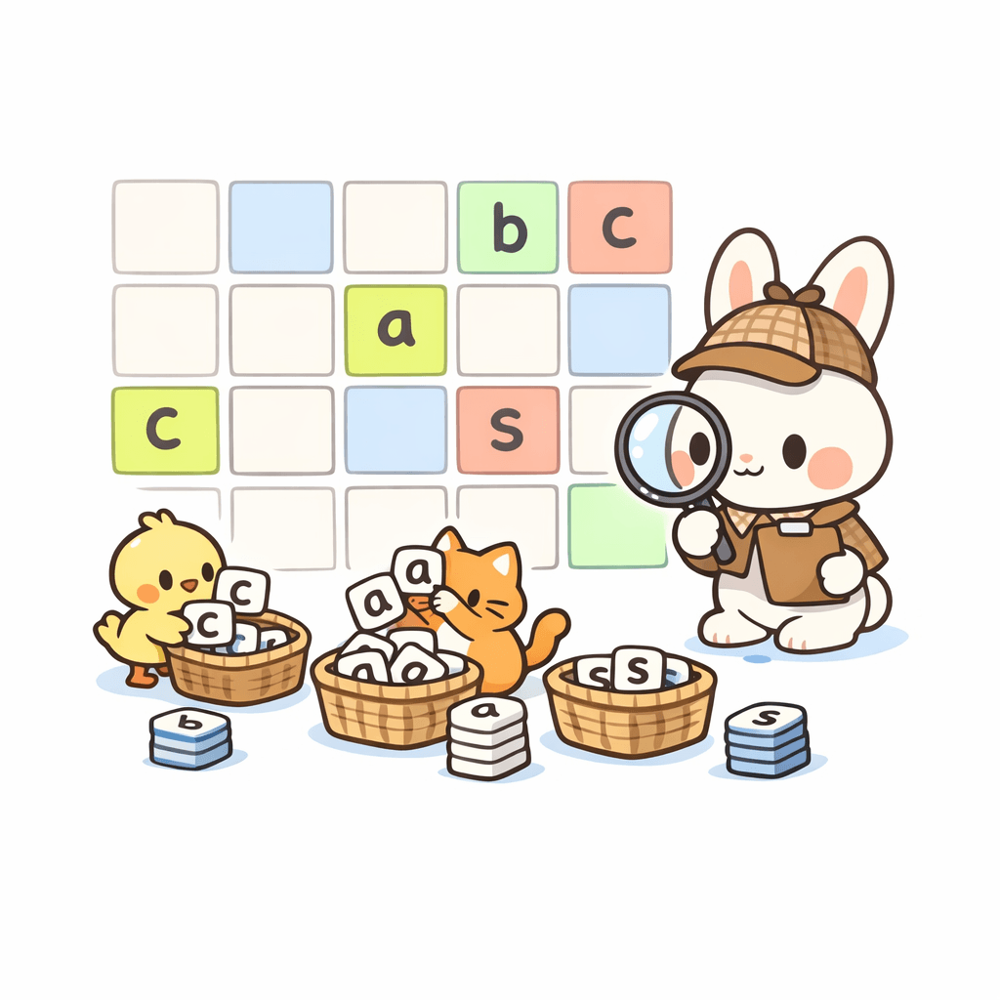

알파벳 소문자로만 이루어진 단어 S가 주어진다. 각 알파벳이 단어에 몇 개가 포함되어 있는지 구하는 프로그램을 작성하시오.

입력
첫째 줄에 단어 S가 주어진다. 단어의 길이는 100을 넘지 않으며, 알파벳 소문자로만 이루어져 있다.

출력
단어에 포함되어 있는 a의 개수, b의 개수, …, z의 개수를 공백으로 구분해서 출력한다.

테스트 케이스
예제 입력

baekjoon
예제 출력

1 1 0 0 1 0 0 0 0 1 1 0 0 1 2 0 0 0 0 0 0 0 0 0 0 0

프라이빗 테스트케이스
5개

프라이빗 입력 1

baekjoon
프라이빗 출력 1

1 1 0 0 1 0 0 0 0 1 1 0 0 1 2 0 0 0 0 0 0 0 0 0 0 0
프라이빗 입력 2

zzzz
프라이빗 출력 2

0 0 0 0 0 0 0 0 0 0 0 0 0 0 0 0 0 0 0 0 0 0 0 0 0 4
프라이빗 입력 3

abcabc
프라이빗 출력 3

2 2 2 0 0 0 0 0 0 0 0 0 0 0 0 0 0 0 0 0 0 0 0 0 0 0
프라이빗 입력 4

qwerty
프라이빗 출력 4

0 0 0 0 1 0 0 0 0 0 0 0 0 0 0 0 1 1 0 1 0 0 1 0 1 0
프라이빗 입력 5

mismatch
프라이빗 출력 5

1 0 1 0 0 0 0 1 1 0 0 0 2 0 0 0 0 0 1 1 0 0 0 0 0 0