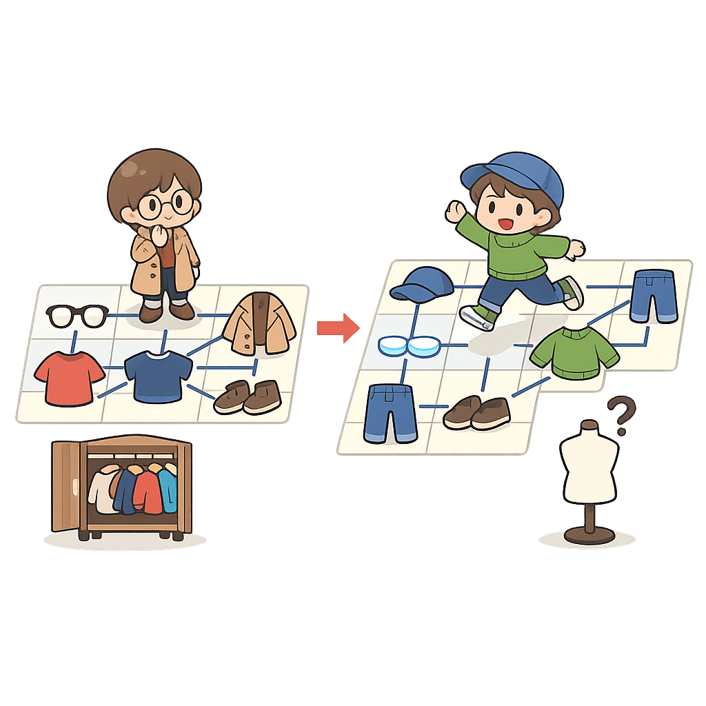

해빈이는 패션에 매우 민감해서 한번 입었던 옷들의 조합을 절대 다시 입지 않는다. 예를 들어 오늘 해빈이가 안경, 코트, 상의, 신발을 입었다면, 다음날은 바지를 추가로 입거나 안경대신 렌즈를 착용하거나 해야한다. 해빈이가 가진 의상들이 주어졌을때 과연 해빈이는 알몸이 아닌 상태로 며칠동안 밖에 돌아다닐 수 있을까?

입력
첫째 줄에 테스트 케이스가 주어진다. 테스트 케이스는 최대 100이다.

- 각 테스트 케이스의 첫째 줄에는 해빈이가 가진 의상의 수 n(0 ≤ n ≤ 30)이 주어진다.

- 다음 n개에는 해빈이가 가진 의상의 이름과 의상의 종류가 공백으로 구분되어 주어진다. 같은 종류의 의상은 하나만 입을 수 있다.

모든 문자열은 1이상 20이하의 알파벳 소문자로 이루어져있으며 같은 이름을 가진 의상은 존재하지 않는다.

출력
각 테스트 케이스에 대해 해빈이가 알몸이 아닌 상태로 의상을 입을 수 있는 경우를 출력하시오.

테스트 케이스
예제 입력

2
3
hat headgear
sunglasses eyewear
turban headgear
3
mask face
sunglasses face
makeup face
예제 출력

5
3

프라이빗 테스트케이스
6개

프라이빗 입력 1

1
3
a hat
b hat
c face
프라이빗 출력 1

5
프라이빗 입력 2

1
1
a mask
프라이빗 출력 2

1
프라이빗 입력 3

1
4
a hat
b face
c face
d hat
프라이빗 출력 3

8
프라이빗 입력 4

1
5
a head
b head
c body
d legs
e legs
프라이빗 출력 4

17
프라이빗 입력 5

1
2
a a
b b
프라이빗 출력 5

3
프라이빗 입력 6

3
0
3
a head
b head
c eye
4
aa face
bb face
cc body
dd body
프라이빗 출력 6

0
5
8